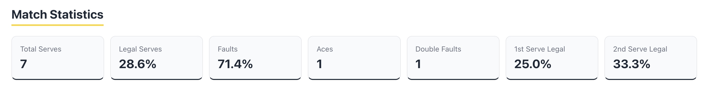
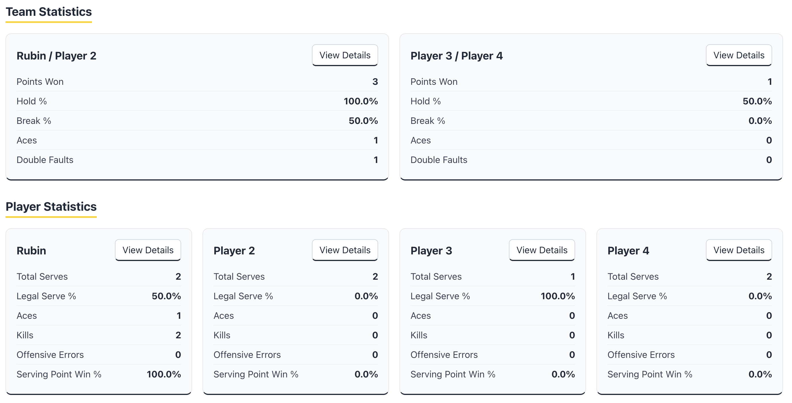

# Roundnet Analyzer

A lightweight, browser-based match analysis tool for reviewing roundnet footage, tagging serve and point outcomes, and generating detailed player, team, and match-level analytics—without specialized video-analysis software.

## Live Demo

[Try Roundnet Analyzer](https://roundnet-analyzer.vercel.app)

## Screenshots

### Match Analysis


### Serve History & Point Tracking


### Match Statistics


---

## Key Features

### Video Analysis & Event Tagging

- **Local Video Analysis:** Upload and review roundnet match footage directly in the browser.
- **Timestamp Tagging:** Tag serves at the video's current playback position.
- **Serve History Jump:** Jump directly to the corresponding video timestamp from Serve History.

### Comprehensive Serve Tracking

- **Serve Parameters:** Track server, serving hand (left/right), serve type, and attempt number (first/second serve).
- **Outcome Logging:** Record legal serves, faults by type, played-through faults, aces, and returned serves.
- **Automatic Double-Fault Detection:** Detect second-serve faults and automatically resolve double-fault points.

### Point & Rally Tracking

- **Point Outcomes:** Record point winners, kills, offensive errors, and other point outcomes.
- **Player Attribution:** Attribute kills and offensive errors to individual players.
- **Automatic Resolution:** Automatically resolve point state for aces and double faults.

### Match Analytics

- **Match Statistics:** Track total serves, serve legality, fault rate, aces, double faults, and first- and second-serve legality.
- **Team Statistics:** Calculate points won, hold percentage, break percentage, aces, and double faults.
- **Player Statistics:** Track serving-point win percentage, serve legality, aces, kills, offensive errors, and other individual metrics.
- **Expandable Statistics:** View additional player- and team-level breakdowns.

### Editing & Match Management

- **Serve Editing:** Correct serve classifications, outcomes, fault information, serve type, and serving hand.
- **Point Editing:** Correct point winners, outcomes, and responsible players.
- **Structural Corrections:** Reopen the most recently completed point when an edit changes the underlying point structure, such as changing an ace or double fault.
- **Undo:** Revert match actions using snapshot-based state restoration.
- **Persistent Match State:** Save match analysis data in browser `localStorage` between refreshes.
- **New Match Reset:** Clear the current match and begin a new analysis.
- **Data Export:** Export complete match data as JSON and serve- or point-level datasets as CSV.

---

## Tech Stack

- **Frontend:** React, JavaScript (ES6+)
- **Build Tool:** Vite
- **Media Handling:** HTML5 Video
- **Styling:** CSS3
- **Storage:** Browser `localStorage`

---

## Architecture & Design Highlights

### Stable Player Identifiers

Players are represented internally using stable IDs rather than display names. This allows a player's name to be changed without breaking relationships between that player and previously recorded serves, points, or statistics.

### Event-Based Match Modeling

Individual serves are stored as match events containing information such as server, hand, serve type, attempt number, legality, fault classification, and result.

Completed points contain their associated serves along with the point winner, outcome, and responsible player. Match, team, and player statistics are derived from this underlying match state rather than stored independently.

### Structural vs. Non-Structural Editing

The editing system distinguishes between classification changes and changes that alter the structure of a point.

Non-structural changes, such as correcting a serve type, can update the existing event directly.

Structural changes—such as changing an ace to a returned serve or changing a double fault into a playable serve—may require reopening the point. To preserve match chronology and prevent inconsistent state, point-reopening structural edits are limited to the most recently completed point.

### Snapshot-Based Undo

Before state-changing match actions, the application stores a snapshot of the relevant match state. Undo restores the previous snapshot, allowing actions involving multiple related pieces of state to be reverted consistently.

### Derived Statistics

Statistics are calculated from recorded serve and point data rather than maintained as separate mutable state. This helps keep analytics synchronized with edits, undo operations, and other corrections to the match timeline.

---

## Getting Started

### Prerequisites

Install a current version of [Node.js](https://nodejs.org/) and npm.

### Installation

1. Clone the repository:

   ```bash
   git clone https://github.com/rubinchang07/roundnet-analyzer.git
   cd roundnet-analyzer
   ```

2. Install dependencies:

   ```bash
   npm install
   ```

3. Start the development server:

   ```bash
   npm run dev
   ```

4. Open the local URL displayed by Vite in your browser.

---

## Data & Privacy

Roundnet Analyzer runs entirely client-side.

Uploaded match videos are processed locally in the browser and are not uploaded to a remote server.

Match analysis data is stored using browser `localStorage`. Browser security prevents the application from retaining access to a locally selected video file after a page refresh or new browser session, so the video must be selected again to resume video playback alongside the saved match data.

---

## Current Limitations (V1)

- **Single Active Match:** One active match is stored in local storage at a time.
- **Manual Video Reselection:** Local video files must be selected again after refreshing or reopening the application.
- **Manual Event Tagging:** Serve and point events are manually tagged by the user.
- **Recent-Point Reopening:** Structural corrections that require reopening a completed point are limited to the most recently completed point.
- **Local Storage Only:** V1 does not include user accounts, cloud synchronization, or a backend database.

---

## Roadmap

- [ ] Support multiple saved matches and match archives
- [ ] Add visual charts and statistical trend graphs
- [ ] Add match-to-match comparison analytics
- [ ] Expand rally-level statistics
- [ ] Explore assisted or automated video event detection
- [ ] Add optional cloud synchronization and user accounts

---

## Author

**Rubin Chang**